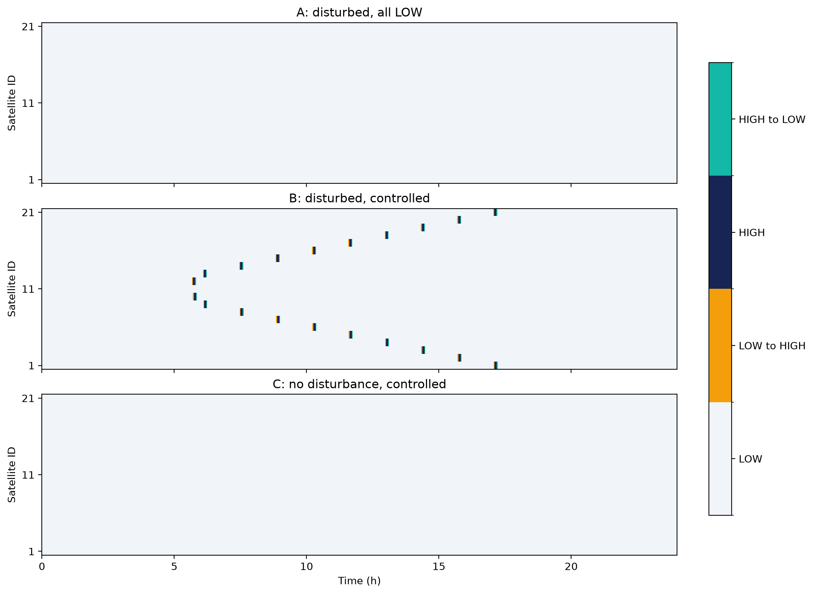
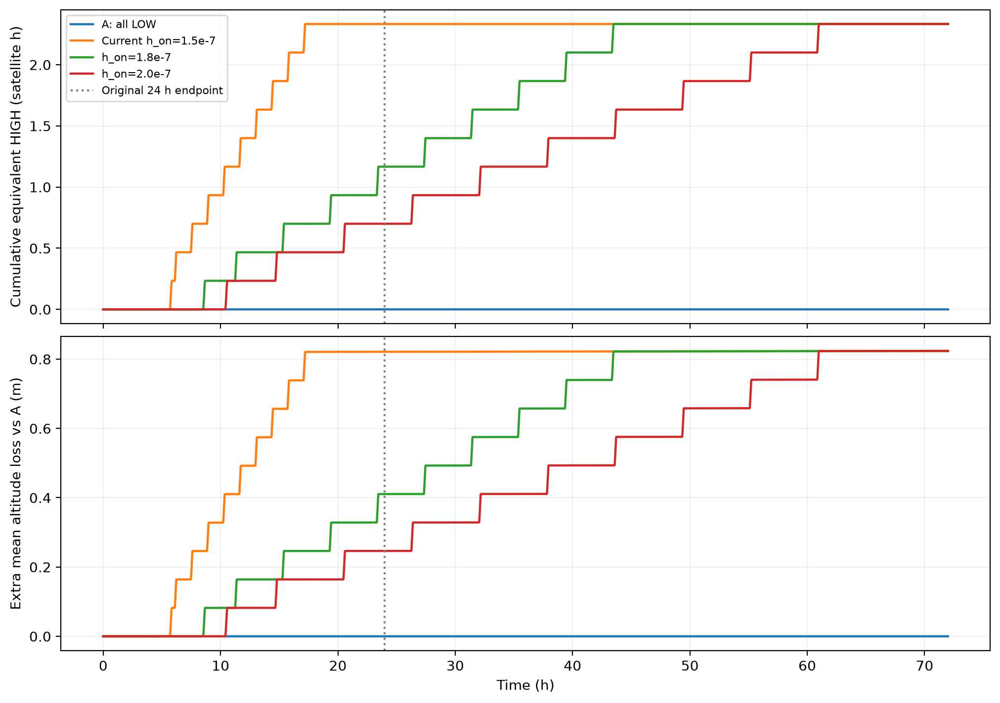

# 衛星列の制御価値・抗力コスト解析

## 結論

**切替伝播は実在し、追加抗力を生む。しかし「不要な大きな高度・寿命損失」を
研究の主動機にする根拠は、今回の条件では弱い。研究軸は、許容編隊誤差の下での
PD・deadband・姿勢変更制約の設計へ寄せ、切替伝播をその評価指標として残すことを推奨する。**

- 現在設定の24時間では、最大間隔誤差が108.454 mから12.424 mへ改善（88.54%）。
- 追加の平均高度損失は0.82115 m、通常の同日全LOW抗力減衰88.66593 mの0.926%。
- 20機で40回の切替、安定HIGH時間は群合計6000 s、面積等価HIGH時間は8400 s。
- 中心から4機以上離れた14機が、追加損失・等価HIGH時間の約70%を担う。
- しかし高めの閾値で見える24時間のコスト削減は、72時間では消えた。
  今回検証した候補では永久停止・持続的局所化を確認していない。
- 制御なしの誤差は24時間で108 m、72時間で363 m。最初の「数十m程度」という
  想定は、今回の無制御ケースの全観測期間には当てはまらない。

単発外乱・決定論的モデルの比較であり、統計的有意性を検定した結果ではない。
実機の寿命影響や40回の姿勢変更の許容可否には、ミッションの要求値が必要である。

## A. Repository understanding

一次情報は main のコミット 9449a78（num1）。現在の configs/baseline.yaml を代表条件とした。
保存済み experiment_13_1.5 と一致する。旧 standard_suite は72時間・別閾値なので区別した。
全アプリケーションモジュール、実験スクリプト、設定、テスト、保存済み条件を確認した。
Notebookはなく、追跡済み .venv は研究コードではない。

| 項目 | 現在の代表設定 |
|---|---|
| 衛星数・列 | 21機、有限開放パス、端部は1近傍 |
| 目標間隔・高度 | 100 km、400 km |
| 質量・抗力係数 | 4 kg、2.2 |
| LOW/HIGH面積 | 0.01 / 0.03 m² |
| 密度・スケールハイト | 3.584968e-12 kg/m³、58.310 km |
| 外乱 | 3 h開始、1 h継続、最大+50%、Gaussian FWHM 100 km、静止 |
| Kp・Kd | 1/21600² s⁻²、2/21600 s⁻¹ |
| h_on・h_off | 1.5e-7 / 1.4e-7 m/s² |
| 制御・遅延・slew・dwell | 10 / 0 / 120 / 300 s（dwellはslew完了後） |
| 数値積分・保存・期間 | RK4最大刻み2 s、保存10 s、24 h |

軌道モデルは近円軌道の平均化モデルで、状態は長半径 a_i とunwrap済み平均経度 lambda_i：

    adot_i = -rho_i CD A_i/m sqrt(mu a_i)
    lambdadot_i = sqrt(mu/a_i³)
    h_i = a_i - R_E

a0=R_E+400 km、d=100 km として、実装された制御量は

    e_i = a0(lambda_(i+1)-lambda_i)-d
    edot_i = a0[n(a_(i+1))-n(a_i)]
    p_i = Kp e_i + Kd edot_i
    q_1=p_1,  q_i=p_i-p_(i-1),  q_N=-p_(N-1)

指令可能時にLOWかつ q_i>=h_on ならHIGH、HIGHかつ q_i<=h_off ならLOW。
それ以外は保持。両閾値は正で、対称な符号関数ではない。
q は切替判定信号であり、直接加える加速度ではない。
各機は初期に同一a、等間隔、全LOW。実際の面積はslew中にcubic smoothstepで変わる。

[全モデル・既存評価量・単位・実行順序](model.md)

## B. Code changes

物理モデル、simulation core、元の制御則、標準設定は変更していない。

| ファイル | 目的 |
|---|---|
| src/sat_string/control_cost.py | イベントからの厳密なHIGH時間、面積等価時間、軌道・エネルギー損失、伝播範囲、連続系固有値 |
| src/sat_string/control_cost_plotting.py | 保存データから代表ケース・閾値・72時間比較図 |
| scripts/run_control_cost_analysis.py | 標準3ケース→7条件実験、各機・各間隔CSV、再集計 |
| scripts/validate_control_cost_analysis.py | 変更前後・保存済み結果・積分刻み半減の比較 |
| scripts/check_control_cost_horizon.py | 既存の72時間という期間で候補の持続性を確認 |
| tests/test_control_cost.py | 部分slew、未開始指令、伝播欠損、エネルギー、Laplacian、線形化、CLI |
| pyproject.toml | 既存のnp.trapezoid使用に合わせNumPy>=2.0へ修正 |
| .gitignore | 新しい解析専用環境と生成package metadataを除外 |

### 指標の定義

- e_max は保存時刻（10 s周期）・全間隔での最大絶対誤差。
- RMSは時間積分平均と全間隔平均。最終誤差・最終間隔速度もJSONに保存。
- N_swは実際に開始した姿勢遷移数。LOW→HIGHとHIGH→LOWを各1回とする。
- T_Hは安定HIGHモードの時間。slewは含めない。
- 面積等価時間は integral[(A_i-A_L)/(A_H-A_L)]dt。
  smoothstepの原始関数を使い、観測終端で切れたslewもイベント時刻から厳密積分する。
- 近円モデルなので高度変化と長半径変化は同じ。
  比軌道エネルギー epsilon=-mu/(2a)、各機エネルギー E=m epsilon。
  符号付き変化と、正を損失とする比較値を両方保存。
- 追加高度コストは同じ外乱を受けるCase Aとの差。
  Case CとAの差には外乱の有無も含まれ、純粋な制御コストと解釈しない。
- 伝播距離は外乱中心機ID=11からのhop数×目標間隔。
  最初のLOW→HIGH開始時刻を使い、実際に切り替わった機数を数える。
- front速度は既存実装と同じく中心から4機以上離れた点を用いる。
  片側3点以上、外向き到達順が単調、未到達機を飛び越さない、正の速度、
  R²>=0.8を満たす場合に限る。未定義はJSON null / CSV空欄で保存。
- 未到達位置は「その観測期間で未到達」。永久停止とは区別する。

## C. Experimental results

### 代表3ケース（24時間）

| ケース | e_max m | RMS m | 切替数 | T_H,total s | 等価HIGH s | 平均高度損失 m | Aより追加の平均損失 m | 群エネルギー損失 J |
|---|---:|---:|---:|---:|---:|---:|---:|---:|
| A 外乱あり・全LOW | 108.454 | 18.328 | 0 | 0 | 0 | 88.66593 | 0 | 32309.40 |
| B 外乱あり・現制御 | 12.424 | 5.992 | 40 | 6000 | 8400 | 89.48708 | 0.82115 | 32608.62 |
| C 外乱なし・現制御 | 2.43e-7 | 8.67e-8 | 0 | 0 | 0 | 88.61644 | — | 32291.36 |

Bの追加エネルギー損失は群合計299.23 J。最大の各機追加高度損失は0.86221 m。
Cの微小間隔誤差は浮動小数点丸めの規模で、切替は発生しない。
全ケースの各機指標、各間隔指標、符号付き変化をresults以下に保存した。

### 切替伝播とコスト

最初の切替はID12の20430 s、続いてID10の20540 s。中央ID11は切り替わらない。
ID21には61410 s、ID1には61460 sで到達する。到達20機、最大10 hop=1000 km。
左右の遠方front速度は20.2634 m/s、R²=0.99999914（各7点）。
切替機は各300 sの安定HIGHと各420 sの面積等価HIGHを消費する。

中心から4機以上離れた14機で切替28回、等価HIGH 5880 s、
追加高度損失の群内和12.07090 m。これは群全体の約70%。
同じ機群のCase Aにおける最大|q|は8.26e-16 m/s²で、閾値から大きく離れている。
これにより遠方の制御活動は外乱だけの状態応答では説明できず、
制御が生んだ近傍状態変化を通じた伝播と整合する。
Gaussian外乱は非コンパクトなので、直接外乱が厳密にゼロだったと主張していない。

### 小規模閾値実験（24時間、7条件）

既存threshold_scan_valuesの範囲から7点のみ選び、h_off=h_on-1e-8を維持。
表中の閾値は10^-7 m/s²単位。T_Hは群合計の安定HIGH秒。
速度は左右で表示桁まで一致する。

| h_on / h_off | e_max m | RMS m | T_H s | 等価HIGH s | N_sw | 追加平均高度損失 m | 到達数 / range km | 速度 m/s |
|---|---:|---:|---:|---:|---:|---:|---|---:|
| 1.00 / 0.90 | 9.717 | 1.737 | 6000 | 8400 | 40 | 0.822640 | 20 / 1000 | 270.270 |
| 1.30 / 1.20 | 7.984 | 1.690 | 6000 | 8400 | 40 | 0.821201 | 20 / 1000 | 212.766 |
| 1.38 / 1.28 | 7.953 | 2.592 | 6000 | 8400 | 40 | 0.821150 | 20 / 1000 | 88.720 |
| **1.50 / 1.40** | **12.424** | **5.992** | **6000** | **8400** | **40** | **0.821150** | **20 / 1000** | **20.263** |
| 1.60 / 1.50 | 17.393 | 7.910 | 5400 | 7560 | 36 | 0.739035 | 18 / 900 | 12.333 |
| 1.80 / 1.70 | 27.348 | 10.339 | 3000 | 4200 | 20 | 0.410575 | 10 / 500 | 未定義 |
| 2.00 / 1.90 | 37.318 | 12.168 | 1800 | 2520 | 12 | 0.246345 | 6 / 300 | 未定義 |

1.6で最初の未到達はID1/21、1.8ではID5/17、2.0ではID7/15。
1.8の速度は遠方フィット点が片側2点だけなので未定義。
ここだけを見ると精度対コストのtrade-offがあるが、終端打切りに注意が必要。

1.38は現在設定に比べ、同程度のコストで最大誤差を約36%減らした。
1.30は最大誤差が1.38より0.031 m大きい一方、RMSが小さい。
単一の「最適閾値」を断定せず、評価目的に応じた候補とする。
CSVのnondominated列は生の数値での有限点比較であり、
微小な高度差や無限時間の優越、全パラメータ空間の最適性を意味しない。

### 72時間の追加確認：見かけの節約を検証

観測時間だけを、既存runs/standard_suiteで使われていた72時間へ延長した。
その他は各24時間条件のまま。追加したのは無制御・現在制御・1.8・2.0の4ケース。

| 条件 | e_max m | RMS m | N_sw | 等価HIGH s | 追加平均高度損失 m | 到達数 / range km |
|---|---:|---:|---:|---:|---:|---|
| A 全LOW | 362.956 | 64.710 | 0 | 0 | 0 | 0 / 0 |
| 現在1.5 | 26.426 | 8.586 | 40 | 8400 | 0.823644 | 20 / 1000 |
| 1.8 | 38.575 | 18.875 | 40 | 8400 | 0.823644 | 20 / 1000 |
| 2.0 | 46.678 | 24.029 | 40 | 8400 | 0.823644 | 20 / 1000 |

**1.8と2.0の24時間でのコスト削減は、72時間では消滅した。**
この2候補では反応を遅らせた結果、誤差が増え、最終的な高抗力量は変わらない。
7点全てを72時間で評価したわけではなく、未検証条件の長期挙動は断定しない。

### 図・表へのリンク

1. [衛星番号×時刻の切替状態](figures/01_switching_states.png)
2. [全間隔の誤差履歴](figures/02_spacing_histories.png)
3. [全機の長半径・高度変化](figures/03_orbital_histories.png) / [追加高度損失](figures/03b_extra_orbital_loss.png)
4. [閾値と最大誤差](figures/04_threshold_accuracy.png)
5. [閾値とHIGH exposure](figures/05_threshold_exposure.png)
6. [閾値と追加高度損失](figures/06_threshold_loss.png)
7. [閾値と観測伝播範囲](figures/07_threshold_range.png)
8. [閾値と切替数](figures/08_threshold_switch_count.png)
9. [精度対コストの有限点比較](figures/09_accuracy_cost.png)
10. [閾値と採用可能なfront速度](figures/10_threshold_front_speed.png)
11. [24/72時間の累積コスト](figures/11_horizon_cost.png)

[代表比較CSV](results/baseline_comparison.csv) /
[閾値CSV](results/threshold_sweep.csv) /
[72時間CSV](results/horizon_check/comparison.csv) /
[代表ケース各機指標](results/baseline/controlled_disturbed/satellite_metrics.csv) /
[代表切替イベント](results/baseline/controlled_disturbed/switch_events.csv)

## D. PD control analysis

[導出・固有値・Lyapunov解析の全文](pd_analysis.md)

接続行列DとL=D^T Dにより、実装は厳密にq=-Kp Lx-Kd Lv。
高抗力によるaの低下が平均運動を増加させるため、現在の切替符号は合理的。

ただし、実装はqをそのまま加速度にする連続制御ではない。
外乱なしの共通LOW減衰軌道まわりで、符号付き面積変化delta_A=q/gを仮定し、
係数を初期時刻に固定した理想線形系に限れば、

    xdot=v
    vdot=-Kp Lx-(Kd L-bI)v
    b=1.7878768973e-8 s^-1
    g=1.7392686348e-4 m^-1 s^-2

となる。相対モードの安定条件はKp>0、Kd*ell_1>b。
現在N=21では満たし、最も遅い固有値対は
-1.0252434e-6 ± 6.8430773e-6 i s^-1。振幅減衰時定数は約11.29日。

相対部分空間上で V=||v||²/2+Kp x^T Lx/2 と置けば、
Vdot=-v^T(Kd L-bI)v。定数係数の理想系について収束を示せる。
共通モードには0と+bの固有値があり、絶対軌道の安定化はしていない。

実際にはLOWから負の面積変化を実現できず、二値化・片側入力・slew・dwell・
サンプリング・時間変動密度がある。この証明は実際のhybrid systemには適用できない。
有限Nの固有値安定性からstring stabilityも結論できない。
deadband内の残留誤差、繰返し外乱、ノイズ、列長に対する保証は今後の課題。

## E. Research recommendation

研究の中心を選ぶという意味では**B寄り**。ただし、切替活動そのものがゼロまたは
観測誤差という意味ではなく、Aの「状態変化より広い制御反応」は確認できた。

大きな寿命損失を強調するより、次の順序が合理的：

1. ミッションの許容間隔誤差・速度誤差・姿勢変更回数を明確にする。
   既存の50 mは回復判定の閾値であり、勝手にミッション要求とは置き換えない。
2. PD、deadband、最小姿勢変更pulse（120 s slew + 300 s dwell）を一緒に評価する。
3. peak重視なら1.38、RMSも重視するなら1.30付近を追加確認する。
   現在の標準設定は変更していない。
4. 切替伝播は速度だけでなく、最終exposure、到達範囲、観測時間と組にして評価する。
5. その後に、根拠のある外乱頻度・大気変動・列長依存へ広げる。

「不要」と断定しない物理的理由：
外乱後の低い中央軌道を差動抗力だけで持ち上げることはできない。
間隔ドリフトを止めるには平均運動をそろえる必要があり、他機の降下を伴う。
24時間の全LOW終端から全機を最低aにそろえる単純な幾何学的降下量は平均0.87430 mで、
観測した追加0.82115 mと同程度である。
これは動的最適制御の下界ではないが、今回の制御活動を即座に浪費と呼べない理由になる。

## F. Git・検証・再現

作業branch：astra/control-cost-analysis。default branch mainへの変更・mergeなし。
コミットの詳細と主要コマンドは [再現手順](reproduction.md) に記載。

検証：

- 変更前の既存テスト64件通過、解析追加後は全72件通過。
- 表示・名称調整後、関連する解析テスト8件も再度通過。
- simulation coreの8ファイルは9449a78から未変更。
- 3ケース全配列・切替イベントが変更前後で一致。
- 保存済みexperiment_13_1.5の全JSON指標・イベントログとも一致。
- dt=2→1 sを現在設定・1.38・2.0で比較。全切替記録・回数・exposureは同一。
  e_maxの差はそれぞれ+4.14e-6、-2.70e-6、+3.95e-6 m。
- 代表ケースの全間隔履歴の刻み依存最大差は1.04e-5 m。
  面積・密度から積分した追加損失と軌道終端差の収支残差は6.94e-9 m。
- 12枚の図を保存。主要図の軸・凡例・重なりを目視確認。
- 生時系列はローカルoutputs/control_cost_analysis内の各results.npzに保存。
  Gitには再生成可能なコードとレビュー用表・図・イベント・設定・検証証拠を保存。

[検証JSON](results/validation.json) /
[全モード固有値](results/linear_modes.csv) /
[数値から計算した解釈の根拠](results/interpretation_diagnostics.json)

